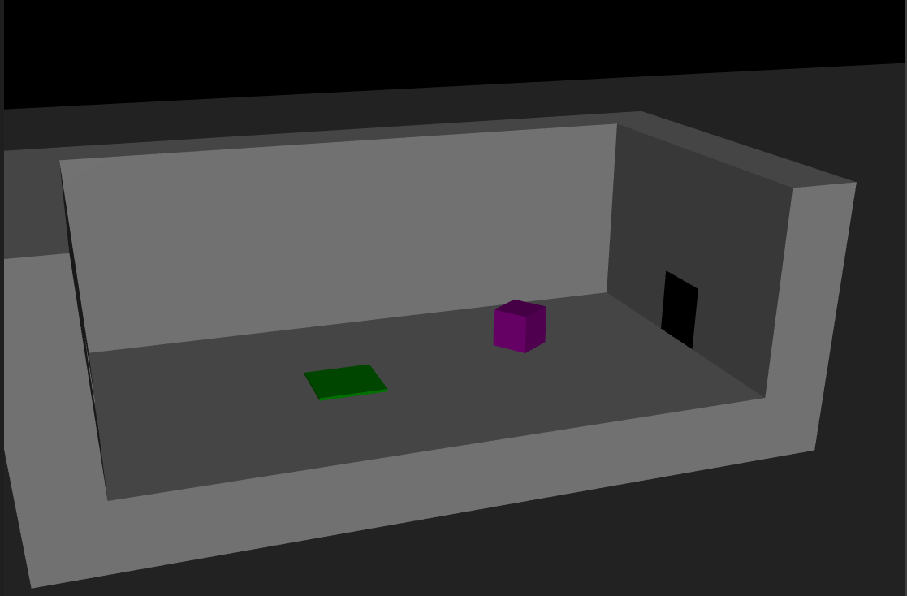
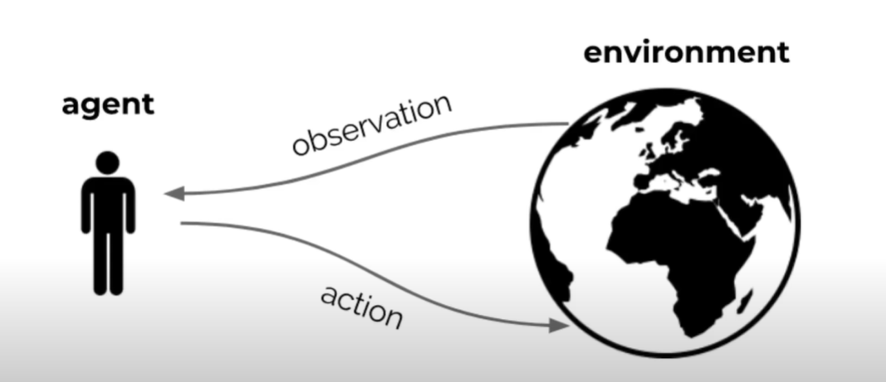
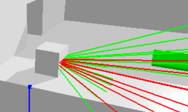

# <ins>Project Presentation<ins/>
This project is based on the following video : https://www.youtube.com/watch?v=v3UBlEJDXR0,
please watch it before starting to work on the project.

### Recapitulation : 
In this project we work with an agent named Albert : It is a cube that can move forward, backward, jump and rotate around itself.
Albert is in a room containing various objects, including barriers and buttons.
The buttons allow, once all pressed, to open the door and allow Albert to exit and therefore solve the level.

### The goal of the project : 
recreate the Reinforcement Learning Environments seen in the video in 3 different physics simulators (Pybullet, Mujoco, isaac Gym)

## Summary : 
#### I - What's an RL Environment

#### II - How To test the different environments

#### III - A presentation of the project's structure

#### IV - A Description of Albert in his Environment

#### V - Specificities of each Simulator

## <ins>I - What's a RL Environment ?<ins/>

### 1 - Reinfocement Learning Problem
Reinforcement Learning is a type of machine learning paradigm where an agent
learns to make sequences of decisions by interacting with an environment. 

Some key elements of RL are the following : 

    - The Agent : it's the actor who's going to interact with the environment. The agent's goal is to learn a policy (a strategy) that maximizes the expected cumulative reward.
    - The Environment : The external system with which the agent interacts
    - The State : The environment's private representation
    - The Action : The set of possible choices or decisions that the agent can make.
    - The Policy : The environment's private representation
    - The Reward : A scalar value provided by the environment after each action is taken. It quantifies the immediate desirability or quality of the action. The agent's goal is to maximize the expected cumulative reward.

In our project we use PPO ( Proximal Policy Optimization ), an algorithm used to train the agent to learn the policy that maximizes the cumulative reward.

Check https://medium.com/mlearning-ai/ppo-intuitive-guide-to-state-of-the-art-reinforcement-learning-410a41cb675b for a first overview of PPO.

### 2 - The Environment 

####  <ins>Interaction Loop</ins>

Here's a basic representation of how the environment works : 

At each step t the agent :
 - executes an action A_t

 - receives an observation O_t
 - receives a reward R_t

the environment :
 - receives action A_t
 - emits observation 0_{t+1}
 - emits scalar reward R_{t+1}

>The environment state S_t is the environment's private representation ( it's the data used to pick the next observation and reward )
>
>The Observation O_t is the environment's information that de agent perceives
>
>The Reward is calculated based on the State
> 
>The Action is chosen based on the Observation

## <ins>II - How To test the different environments<ins/>

### 1 - Installation requirements

#### Pybullet
> pip install pybullet
> 
> pip install numpy
> 
> pip install gym
>
> pip install stable-baselines3

#### Mujoco
> pip install mujoco
> 
> pip install numpy
> 
> pip install scipy
> 
> pip install gym
> 
> pip install torchvision
> 
> pip install stable-baselines3
> 
> pip install shimmy
> 
> pip install tensorboard

### 2 - Testing the various simulations

#### For testing Mujoco
    Launch MujocoSimu2/RLTests/test.py

#### For testing Pybullet
    PybulletSimu/RLTests/test.py

In both programs you can move albert to see how it interacts with the environment by using the following keys : 

  -  up key : move forward
  -  down key : move backward
  - left key : turn left
  - right key : turn right
  - space key : jump

## <ins>III - A presentation of the project's structure<ins/>

### 1 - Composition

The blueprint of the project in Pybullet and Mujoco is the same : 

- A folder (Pybullet/Mujoco) containing a folder ObjectsEnvironment and a folder RL Test
- A package named gym_albert_(pybullet/mujoco) containing the file AlbertEnv.py
- the Enums.py file for all the enum objects (ObjectType,MoveType,TurnType,JumpType)

### 2 - Details about the various files in the folder Pybullet or Mujoco

#### ObjectsEnvironment
ObjectsEnvironment is the folder containing the class files of the project's objects : 

- Cube.py : Base object, the parent class of all simulation components.
- Button.py :  Button class: has an attribute is_pressed = True if Albert pressed the button
- Fence.py : Class of fences of varying height and width
- IBlock.py :  Class of pillars of variable height on which Albert can jump
- Room.py : Class of levels in which Albert will evolve
- Albert.py : Class of the agent Albert
- RoomManager.py : Class storing and managing the different levels available: The room_array attribute is a list to which the levels are stored using the add_room(room) function.

**Let's dive into the important classes :**

**<ins> Albert.py : <ins/>**

<ins>General attributes :<ins/>

- actual_room : level in which Albert evolves ( index of the level in **room_manager.room_array**)
- room_manager
- id
- current_state : describes the environment state :  
> **current_state** = { 
>
>    **'CharacterPosition '**  = [x,y,z]_local, Albert's position
>
>    **'doorState'** = door , with door = 1 if all buttons are pressed
>
>    **'doorPosition'** = [x,y], the position of the door
>
>    **'buttonsState'** = [b0,..,bn], with n the number of buttons and bi=1 if the button i is pressed
>
>    **'contactPoints'** = [t0,...,t6] with ti the i th type  of object in contact with albert

}
- memory_state : array which stacks the 5 last environment states 
- memory_observation : array which stacks albert's 5 last observations :

        [obs0,...,obs4] , obs4 being the lastest observation

        obsi = [type_{0_i},...,type_{21_i},distance_{0_i},...,distance_{21_i}]
>type_{j_i} = type of the object detected by the ray j during observation i
> 
>distance_{j_i} = distance of Albert to the object detected by the ray j during observation i

<ins>General functions :<ins/>

- has_fallen() : returns True if Albert has fallen off the level
- reset_position_orientation(position,orientation_{euler}) : resets Albert's position and orientation ( local coordinates )
- raycasting() : 21 rays are cast from Alberts center of mass permitting him to watch his surroundings **For more information, go to the **<ins>Vision<ins/>** paragraph
- take_action(action) : separates the action array into variables : rotate,move,jump, calls the 3 displacement functions, than updates the environment state.
- move(move) : Check the **<ins>Displacement<ins/>** Paragraph
- yaw_turn(rotate) : makes Albert rotate around himself,  Check the **<ins>Displacement<ins/>** Paragraph
- jump(jump,move) : Check the **<ins>Displacement<ins/>** Paragraph
- get_observation() : returns the observation set in the correct format
- check_type(id,room) : returns the type of the object (ObjectType in Enums.py ) corresponding to **id**
- add_to_memory_observation(current_observation) : appends the last made observation to the memory_observation array
- add_to_memory_state(current_state) : appends the last environment state to the memory_state array
- get_previous_state()
- get_current_state() 
- binarize_button_states(buttons) : returns an array of all is_pressed values binarized (1 and 0)
- flat_memory() : formats the memory_observation into the correct form : 

      From  [[type0_0,...,type21_0,distance0_0,...,distance21_0],...,[type0_4,...,type21_4,distance0_4,...,distance21_4]]

      To [type0_0,...,type21_0,type0_1,...,type21_1,...,type21_4,distance0_0,...distance21_4]

**<ins> Room.py : <ins/>**

<ins>General attributes :<ins/>

- global_coord : global coordinates of the room
- buttons_array : dictionary containing all the buttons of the room (the keys being the ids of the buttons)
- floor_array : list containing the ids of all the cubes forming the floor
- wall_array : list containing the ids of all the cubes forming the walls
- iblocks_array : list containing the ids of all the iblocks present in the room
- fences_array : list containing the ids of all the fences present in the room
- door_array : list/dictionary ( it depends on which simulator ) containing the door

<ins>General functions :<ins/>

- change_global_coord(x,y,z)
- check_buttons_pushed() : opens the door is all buttons are pressed
- reset_room() : resets all pressed buttons and closes the door
- translate(id,translation) : apples a translation to the object's position

#### gym_albert
        Go to gym_albert/gym_examples/envs/AlbertEnv.py

In the following we will be talking about space attributes **( state_space,observation_space, action_space)**
These attributes are blueprints of the actual attributes **(curr_state,current_obs and action which is not an attribute but is part of the environment )**
they define the type of structure that contains the information and the maximum and minimum values accepted.
For more information read the following documentation : https://www.gymlibrary.dev/api/spaces/

<ins>General attributes :<ins/>

- room_manager
- character : object of Albert's class
- state_space : **{ 'CharacterPosition ' ,'doorState', 'doorPosition' , 'buttonsState' ,'contactPoints' }**
- curr_state : current state 
- prev_state : previous state
- observation_space : 

      [type0_0,...,type21_0,type0_1,...,type21_1,...,type21_4,distance0_0,...distance21_4]
  look at part 3 to see the difference between Pybullet and Mujoco on that matter.

- action_space : [turn,move,jump], these variables are detailed in the **Displacement** paragraph
- rng : to randomize Albert's initial position
- current_obs : Albert's current observation
- time_episode : time Albert has to go through the door before an automatic reset
- time_passed : time passed since the beginning of the episode

<ins>General functions :<ins/>

- step(action) : returns the next observation,reward, and ends the simulation if certain conditions are met
- reset()
- render() : calculates one step forward, renders the visual aspect of the simulation
- button_distance() : returns the number of buttons Albert pushed during the last step
- achieved_maze()
- update_state() : updates the current and previous states

## <ins>IV - A Description of Albert in his Environment<ins/>

Here's how a RL environment episode looks like : 

> - current_observation = environment.reset()
> - action = f(current_observation)
> - done = False
> - while not done:
>   - current_observation,reward,done = environment.step(action)
>   - action = f(current_observation)
> 
> f() being the trained policy

### Gym details : 

#### actions  : [turn,move,jump]
The values that those 3 variables can take can also be seen in Enums.py

- turn : 0 = doesn't turn, 1 = turns left, 2 = turns right
- move : 0 = doesn't move, 1 = moves backward, 2 = moves forward
- jump : 0  = doesn't jump, 1 = jumps

#### observations : a 5 observation memory length, 21 rays, returning : 
    (type[0],...,type[104],distance[0],...,distance[104]) for Pybullet
    (type[0],...,type[630],disance[0],...,distance[104]) for Mujoco ( the difference is explained in V- )

 #### done = True if : 
- simulation time > 20 sec
- albert falls off the level
- albert succeeds in passing the door

#### reset() : 
- calls room.reset()
- Albert gets a random position : x ∈ [ 1, 3 ]   y ∈ [ 1, 5 ]   z = 0.75
- Albert gets a random orientation : θx = 0, θy = 0, θz ∈ [-π,π]

#### rewards :
Reward calculation is details in part V due to a difference in calculation between the simulators

### Albert's Displacement
Albert can move forward,backward,rotate and jump.

During his jump he can rotate but can't change his trajectory

These next 3 displacement functions are based on **immediate impulse** ( during a step than stopping ):
the impulses are added together by the simulator to compute the total force vector applied to Albert

#### action space : action = [turn,move,jump]

#### move(move) : 

        forward : impulse $step * [250,0,0]_{Albert's Referential}$ (in N)
        backward : impulse $step * [-250,0,0]_{Albert's Referential}$ (in N)

#### yaw_turn(turn):

        left : angular velocity "impulse" $[0,0,-10]_{Albert's Referential}$
        right : angular velocity "impulse" $[0,0,10]_{Albert's Referential}$

#### jump(jump,move) : 
the jump functions for each simulator are different and therefore will be further explained in part V 

### Albert's Vision
Albert's vision is done with the **raycasting()** function :

**<ins>description<ins/>** :
21 rays are cast from the center of Albert gridding the environment in front of Albert to a certain extent.
Each ray has a maximum length 'ray_length'. 
If a ray hits an object before reaching its maximum length, it returns the information on the type of object detected and its distance to Albert's center of mass.
If nothing is detected, the ray returns the object type 0 or -1 ( 0 if it hits the plane ) and its max length.

        raycasting() -> [[obj1,distance1],...,[obj21,...,distance21]]

The function is structured of 3 parts : 

    - grid_vision() : that returns the end position of each ray following its orientation

    - a for loop that casts the ray and returns information on each encountered object

    - a for loop that stacks the needed information on each encountered object

1- grid_vision(character_pos,character_ori,ray_length) :
- the 21 rays are set into 3 rows of 7 rays all spaced uniformly
- the function returns an array of the 21 end positions of the rays
	
2- in this for loop :
- the raycasting function of the used simulator is called 21 times
- the returned information of each ray collision is stacked in an array
	
3- the information is refined to only have the needed information
note that this part is done in the raycasting() function for Mujoco but in get_observation() for Pybullet

## <ins>V - Specificities of each Simulator<ins/>
### <ins>Pybullet<ins/>
https://pybullet.org/wordpress/
#### Environment characteristics :

---
Gravity : g = -100 m/s²

Albert's mass : m = 10 kg

Integration step :step(dt) = 1/240 s

---

>Difference in the Observation Space : (type[0],...,type[104],distance[0],...,distance[104])
> 
>with type = [0,1,2,3,4,5] = [none,button,ground,wall,fence,iblock]

>Difference in reward computation : 
>- -0.05 if Albert jumps
>- -0.1 if Albert has a contact with a wall,fence or iblock
>- -0.5 if Albert falls off the level
>- +1 if Albert achieves the maze
>- +1 if Albert pushes a button

#### Raycasting : 

---
#### Difference in what raycasting() returns : 

[[id_0,distance_0],...,[id_21,distance_21]]

this array is converted into  : [[type_0,distance_0],...,[type_21,distance_21]] in the get_observation() function

#### Difference in grid_vision : 
 -  yaw : 7 rays covering 70° in [-35°,35°]
 - pitch : 3 rays covering 20° in [-10°,10°]

---

#### Equations used : 

**Semi-Explicit Euler :**
> - **F = m*a**
> - $(τ = I * (dω/dt) + ω * I*ω)$
> - $v_{t+Δt} = v_t + a * Δt = v_t + (F_{ext} + F_c)/m * Δt = v_t + F_{ext}/m * Δt + impulse_c/m$
> - $x_{t+Δt} = x_t + v_{t+Δt}*Δt$
>
$F_{ext}$ : gravity, wind force field, user forces ...

$F_c$ : constraint forces such as contact, friction, joints

> the p.applyExternalForce() function takes as a parameter an array[x,y,z] in Newtons (N)

 It's an impulse : (F*step)

**Friction :** 

> linear damping : $F_{damping} = - v_{albert} * linearDampingCoef$
> 
> linear_damping_coef = 4 kg/s

> angular damping : $τ_{damping} = - ω_{albert} * angularDampingCoef$
> 
> angular_damping_coef = 4 kg*m^2/s

#### Room Creation

---
The Room is Manually added in AlbertEnv.__init__()

you can directly change the configuration of the room by adding elements in it

---
### <ins>Mujoco<ins/>
https://mujoco.readthedocs.io/en/latest/overview.html

#### Environment characteristics :

Gravity : g = -10 m/s²

Albert's mass : m = 10 kg

Integration Steps : step(dt) = 0.001. s - To change this value, modify

>Difference in the Observation Space : (type[0],...,type[630],distance[0],...,distance[104])
> 
>with type[i:i+6] = [x,x,x,x,x,x] = [none,button,ground,wall,fence,Iblock]
> 
> x=1 for the right type of object and x=0 elsewhere

>Difference in reward computation : 
>- -0.05 if Albert jumps
>- -0.05 if Albert doesn't move
>- -0.1 if Albert has a contact with a wall,fence or iblock
>- -0.5 if Albert falls off the level
>- +0.03 for each ray that perceives a button
>- +2 if Albert achieves the maze
>- +1+(1-time_spent_in_simu/time_episode) if Albert pushes a button ( the faster he gets to it the more reward he gets )

#### Raycasting : 

---
#### Difference in what raycasting() returns : 

[[type,distance_0],...,[type_21,distance_21]]

#### Difference in grid_vision : 
 -  yaw : 7 rays covering 70° in [-35°,35°]
 - pitch : 3 rays covering 20° in [-12°,+3°]

---

#### Equations used : 

---
#### Forward Dynamic equation :
> - $M(dv/dt) + c =s τ  $
> - M : joint space inertia matrix, c = bias forces,τ = applied force
> - $v_{t+Δt} = v_t + a_t * Δt = v_t + (F_{ext} + F_c)/m * Δt = v_t + F_{ext}/m * Δt + impulse_c/m$
> - $x_{t+Δt} = x_t + v_{t+Δt}*Δt$
>
$F_{ext}$ : gravity, wind force field, user forces ...

$F_c$ : constraint forces such as contact, friction, joints

> the data.xfrx_applied[id] value has as value an array[x,y,z] in Newtons (in N)

It's an impulse (F*step)

#### Friction : 

in xmlDirectory/Actor.xml :
damping = 1
diaginertia = [0.001 0.001 0.001]

---

#### Room Creation

---

- mjcf files of the room and the actor are uploaded in AlbertEnv.__init__() then merged together to create the mujoco model

- mjcf files are located in the xmlDirectory

- The mjcf file Actor.xml is the file that contains the Albert object

        **To create a mjcf file for a room** :
            - Go to XmlConversionDirectory/CreateMjcfRooms.py
            - run add_room_by_number() and chose the file name and the room_index that you want
            - add_room_by_number() calls xml_room_manager_pybullet() (from xmlConverter.py) to convert the chosen room into a mjcf file

---

### How to train the PPO model : 

    Launch Mujoco/RLTests/PPO2.py

- The used neural network is a MLP ( Multi Layer Perceptron) with 735 inputs (630 of type and 105 of distance) and 3 hidden layers

- The call model.learn() launches the training, change the number of timestep to change the size of the training

- the model is then saved in Mujoco/RLTests/trained_model_directory/ppo_model.zip

- to change the trained model, change the name in the call **model.save()**

- To view the training, the tensor board information is contained in **TLTests/albert_training_tensorboard**

METTRE LA LIGNE DE COMMANDE POUR LANCER TENSORBOARD

### How to view the trained model in the simulation : 
    Launch Mujoco/RLTests/TestModel.py

- the model is loaded with **PPO.load("./trained_model_directory/ppo_model")**

- to change the trained model, change the name in the call **PP.load()**

Then in the environment loop, the call : **loaded_model.predict(obs)** returns the optimized action